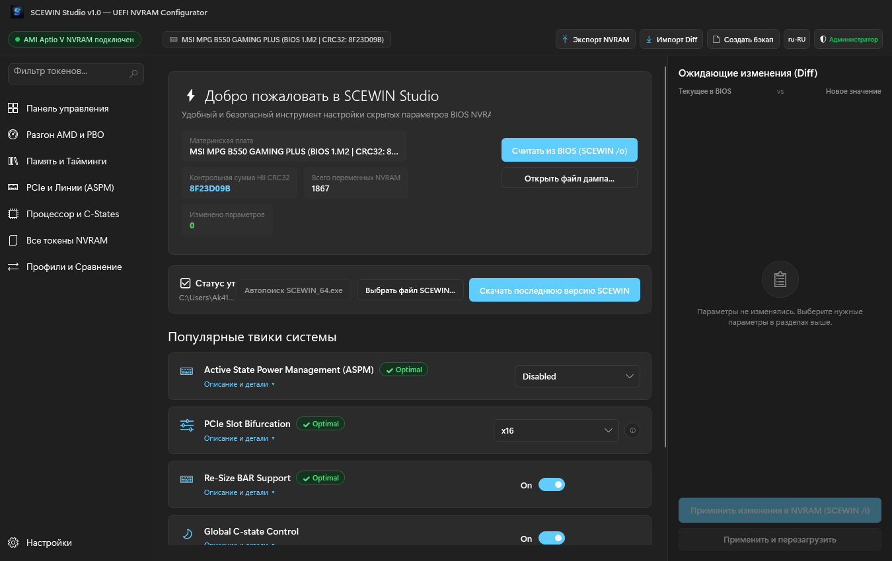
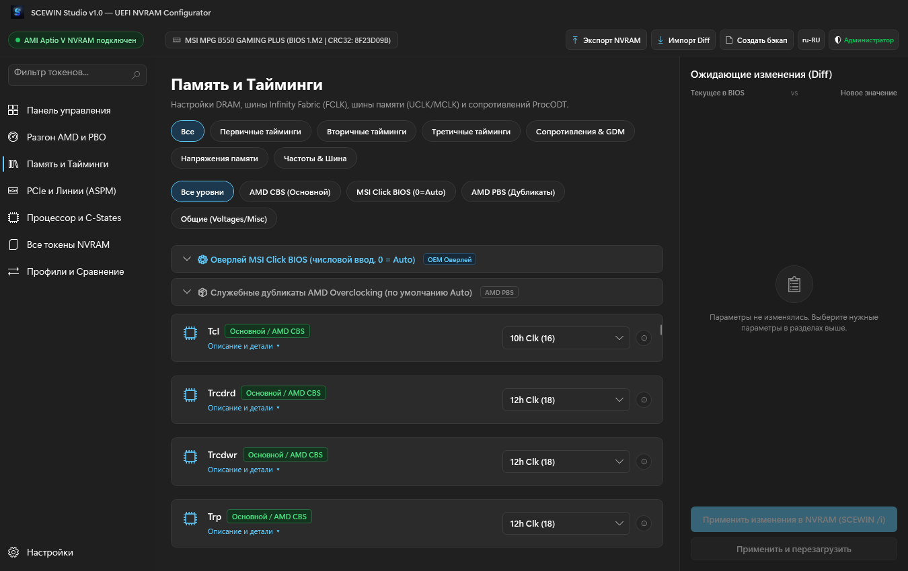
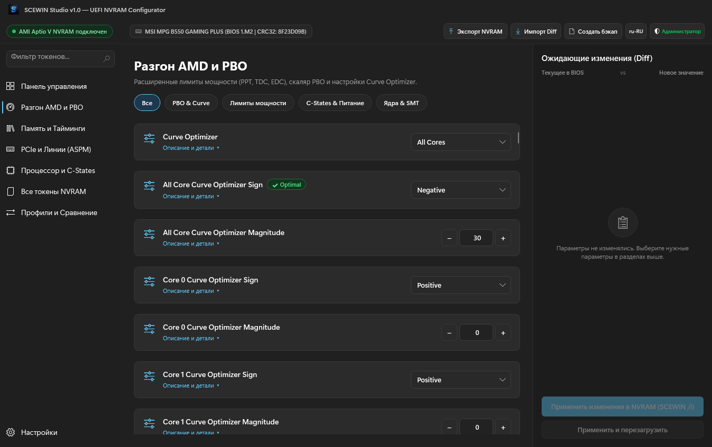
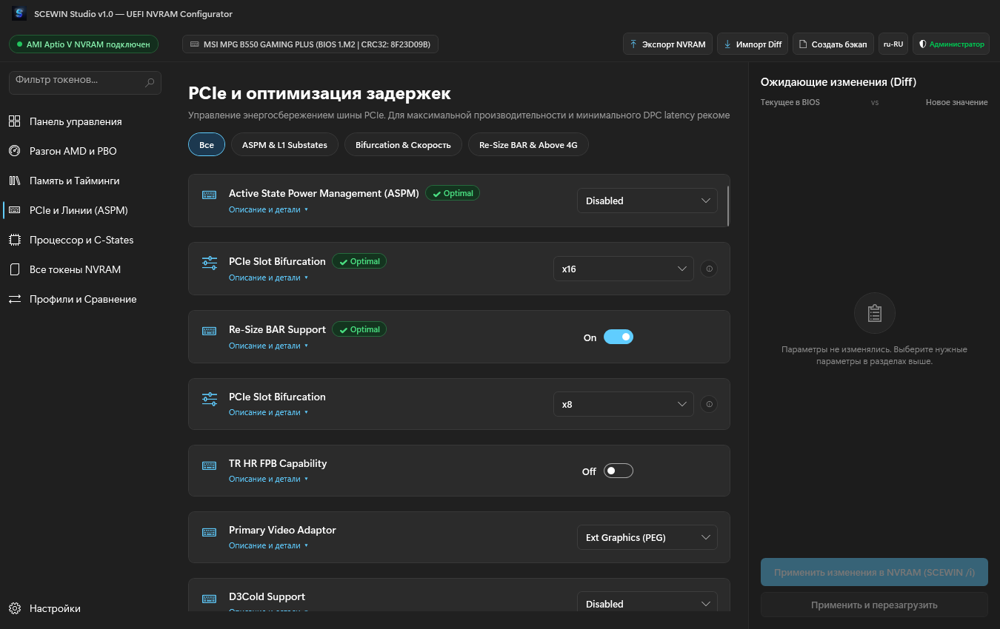
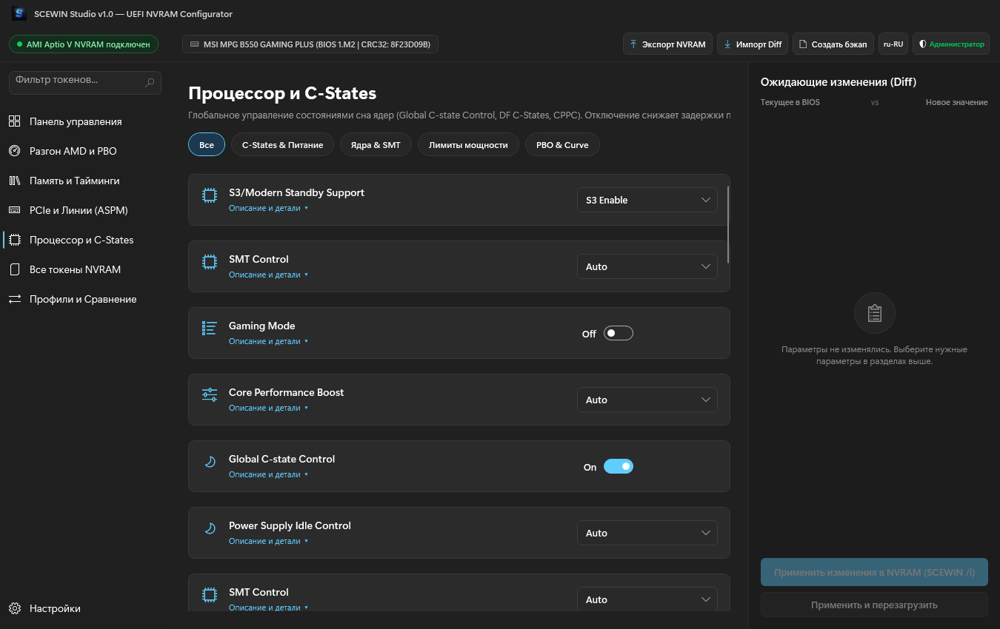
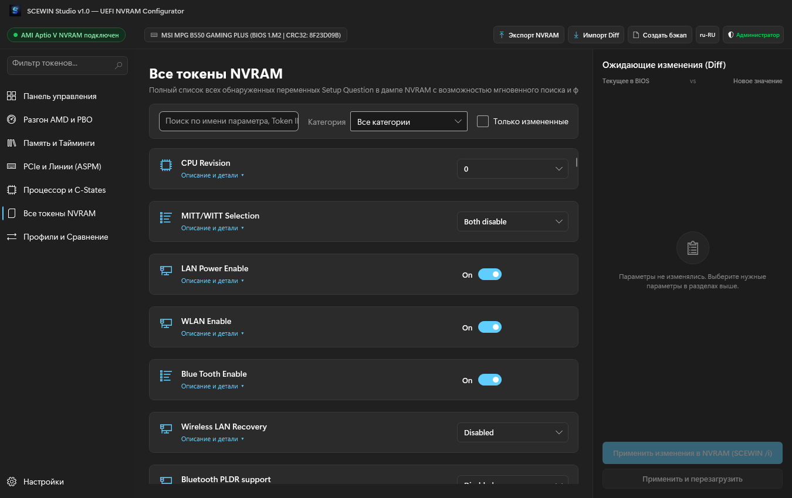
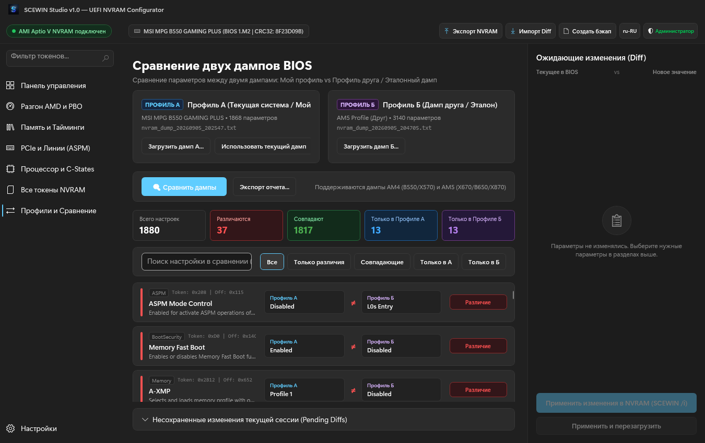
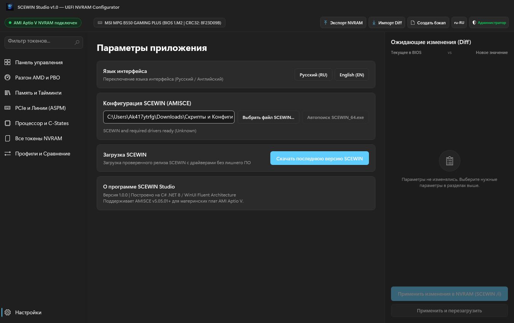

# SCEWIN Studio

SCEWIN Studio is a graphical configuration interface and diagnostic utility for inspecting, modifying, and comparing AMI Aptio V UEFI NVRAM setup variables on x86-64 platforms. The utility interfaces with the American Megatrends Setup Configuration Engine (AMISCE / SCEWIN) driver stack, providing direct access to firmware setup tokens without requiring interactive UEFI Setup menu navigation.

Designed primarily for low-level tuning on AMD AM4/AM5 platforms and modern Intel motherboards, the application is optimized for firmware tables exceeding 3,000 to 4,000 NVRAM setup tokens, ensuring smooth navigation, virtualized rendering, and safe configuration deployment.

---

## Overview

Modern UEFI implementations expose thousands of configurable setup parameters through HII (Human Interface Infrastructure) data structures stored in SPI flash NVRAM. Many performance-critical parameters—such as sub-timings, Precision Boost Overdrive scalar limits, Curve Optimizer offsets, PCIe ASPM link states, and bus clock dividers—are often hidden from standard vendor BIOS setup menus or scattered across vendor-specific sub-menus.

SCEWIN Studio parses raw SCEWIN NVRAM dumps, categorizes all discovered tokens into functional domains, and provides a structured interface for reading, modifying, and staging firmware adjustments. Modified values can either be written directly to active NVRAM via the AMI kernel driver or exported as minimal delta scripts for scriptable flashing.

---

## System Requirements

- Operating System: Windows 10 (build 19041 or newer) or Windows 11, 64-bit.
- Firmware Architecture: AMI Aptio V UEFI.
- Administrative Privileges: Administrator rights are required to load the AMI kernel driver (`amifldrv64.sys` or `amigendrv64.sys`) for live NVRAM access.
- Runtime Prerequisites:
  - Standalone package (`SCEWIN_Studio.exe` or `SCEWIN_Studio_win-x64_SelfContained.zip`): None.
  - Framework-dependent package (`SCEWIN_Studio_win-x64_FrameworkDependent.zip`): Microsoft .NET 8 Desktop Runtime (x64).

---

## Architecture and Capabilities

### Token Categorization Engine

Raw NVRAM dumps present setup variables as unorganized linear lists of HII question blocks. SCEWIN Studio implements a multi-stage classification pipeline that evaluates question strings, help descriptions, and token offsets:

- Memory Subsystem: Primary, secondary, and turnaround timings, drive strengths, bus termination (ProcODT, RttPark/Nom/Wr), and clock dividers.
- Overclocking and PBO: Precision Boost Overdrive operational modes, scalar multipliers, PPT/TDC/EDC power thresholds, and per-core Curve Optimizer magnitudes.
- PCIe and Power Management: Active State Power Management (ASPM L0s/L1/L1 substates), Resizable BAR (ReBAR), Above 4G Decoding, and PCIe slot bifurcation modes.
- CPU Power and C-States: Global C-State controls, DF C-States, Core Performance Boost (CPB), and Collaborative Processor Performance Control (CPPC).
- Raw Catalog: Unfiltered access to every discovered token with debounced full-text searching across names, hex offsets, and help strings.

### Multi-Tier Memory Disambiguation

AMD UEFI implementations often contain duplicate tokens representing identical hardware parameters across different firmware layers:

- AMD CBS (AmdSetup): Hardware-level AGESA parameters executed directly by the processor memory initialization routines.
- MSI OC Engine / OEM Overlays: Vendor-specific setup menus that translate user values into AGESA parameters, frequently using `0 = Auto` semantics instead of raw timing values.
- AMD PBS: Platform-level peripheral and board-specific duplicate tokens.

SCEWIN Studio identifies these tiers automatically, distinguishing authoritative AGESA controls from vendor overlays to prevent conflicting adjustments.

### Dual Dump Comparison Engine

The comparison engine performs deterministic side-by-side differential analysis between two distinct NVRAM dumps:

- Token Alignment: Matches variables across firmware revisions using normalized question identifiers and token offsets.
- Differential Filtering: Segregates parameters into Modified, Identical, Exclusive to Dump A, and Exclusive to Dump B.
- Delta Export: Generates minimal diff scripts containing solely the modified tokens with verified HII CRC32 headers, minimizing write cycles and eliminating collateral register modifications.

### Safety Model

Firmware configuration errors can lead to non-bootable hardware states requiring CMOS clearing. SCEWIN Studio implements multiple defensive layers:

- Pre-Write Backup: Automatically captures a full timestamped NVRAM dump before applying any modifications to the system.
- Staging and Review: All modifications are buffered in a persistent review drawer; changes must be explicitly inspected prior to commit.
- CRC32 Validation: Ensures exported delta scripts match the target firmware's HII checksum.
- Process Hygiene: Cleans up orphaned driver handles and background processes to avoid locking firmware devices.

---

## UI Overview

### Dashboard
Connection status, motherboard hardware identity, BIOS version string, HII CRC32 checksum, system quick-tweak cards, and the pending changes review panel.



### Memory Tuning
Three-tier memory hierarchy displaying AMD CBS, vendor OC engine, and AMD PBS parameters with chip-based sub-category filtering.



### Overclocking and PBO
Precision Boost Overdrive configuration, scalar settings, power envelope limits (PPT/TDC/EDC), and per-core Curve Optimizer signed offsets.



### PCIe and ASPM Configuration
Bus power management, ASPM link states, L1 substate policies, Resizable BAR, and slot bifurcation control.



### CPU Power Management
Global C-state controls, DF C-states, CPPC autonomous frequency selection, and platform sleep state configurations.



### Raw Tokens Catalog
Virtualized token browser providing rapid filtering, offset inspection, and search across thousands of NVRAM parameters.



### Dual Dump Comparison
Side-by-side profile comparator with category breakdowns, difference tallies, and delta export capabilities.



### Settings and Driver Diagnostics
Detection and management of local AMI SCEWIN executables and kernel driver installation.



---

## Installation and Usage

### Obtaining Binaries

Compiled packages are available under [GitHub Releases](https://github.com/hiez1337/SCEWIN-Studio/releases):

- `SCEWIN_Studio.exe`: Single-file portable executable containing the application runtime and embedded AMI drivers.
- `SCEWIN_Studio_win-x64_SelfContained.zip`: Standalone archive for environments where running from an extracted directory is preferred.
- `SCEWIN_Studio_win-x64_FrameworkDependent.zip`: Minimal archive requiring the system to have .NET 8 Desktop Runtime installed.

### Basic Workflow

1. Run `SCEWIN_Studio.exe` as Administrator.
2. Click "Read NVRAM" to dump current firmware configuration, or click "Load Dump" to open an existing NVRAM text export.
3. Browse tokens via domain-specific navigation tabs or use the Raw Tokens catalog.
4. Adjust parameters as needed. All changes are recorded in the Staged Changes panel on the right.
5. Review the staged modifications.
6. Click "Apply to NVRAM" to flash the changes directly, or click "Export Diff" to save a minimal AMISCE script for deferred or external execution.
7. Reboot the system for firmware changes to take effect.

---

## Building from Source

### Prerequisites

- Windows 10/11 x64 (build 19041+)
- [.NET 8.0 SDK](https://dotnet.microsoft.com/download/dotnet/8.0)

### Compilation

Clone the repository and build the release configuration using the .NET CLI:

```powershell
git clone https://github.com/hiez1337/SCEWIN-Studio.git
cd SCEWIN-Studio

# Build the solution
dotnet build SCEWIN_Studio.sln -c Release

# Publish self-contained single-file executable
dotnet publish src/SCEWIN_Studio/SCEWIN_Studio.csproj -c Release -r win-x64 --self-contained true -p:PublishSingleFile=true -p:IncludeNativeLibrariesForSelfExtract=true -o ./publish/self-contained
```

---

## Verification and Testing

The repository contains an automated test suite implemented in xUnit:

```powershell
dotnet test SCEWIN_Studio.sln -c Release
```

Test coverage includes:
- Parser correctness across real-world AM4 (AMD B550) and AM5 (AMD X670/B650) firmware exports.
- Performance validation under high token counts (3,500 to 4,000 tokens parsed in under 350 ms).
- Thread-safe collection operations and debounced search filtering.
- Two-way dump diffing logic and duplicate token handling.
- Localization resource integrity across supported locales.

---

## Disclaimer

SCEWIN Studio writes directly to UEFI NVRAM registers via kernel-level device drivers. Setting invalid timings, voltages, or frequency dividers may cause boot failures requiring a physical CMOS reset (Clear CMOS). Always maintain verified NVRAM backups before applying untested parameter modifications.
