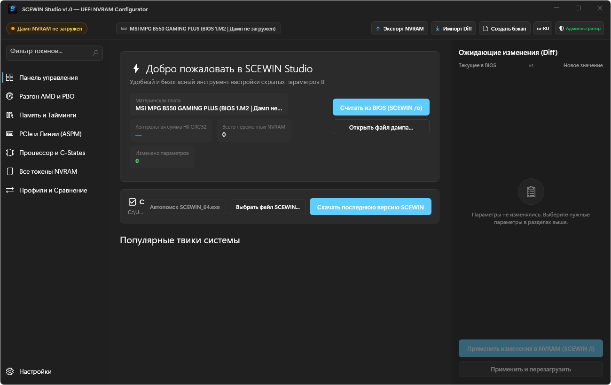
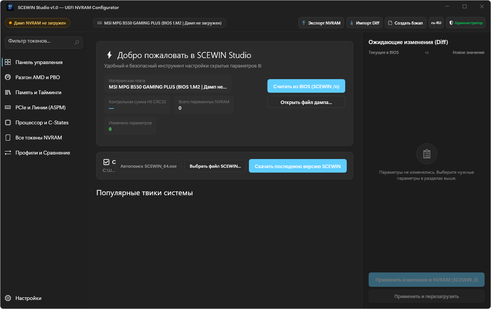
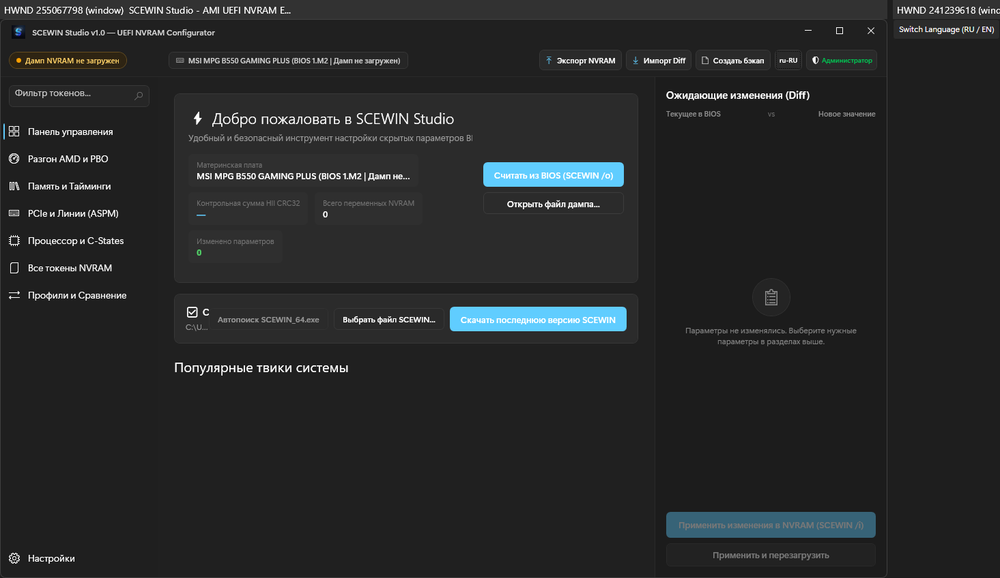

# SCEWIN Studio

<p align="center">
  
</p>

<p align="center">
  <a href="https://github.com/hiez1337/SCEWIN-Studio/releases"></a>
  <a href="https://github.com/hiez1337/SCEWIN-Studio/actions"></a>
  
  
  
</p>

**SCEWIN Studio** — современный графический конфигуратор (GUI) на базе **.NET 8** и **Fluent Design (Windows 11 UI)** для низкоуровневого управления, редактирования и сравнительного анализа переменных **UEFI NVRAM** с помощью официальной системной утилиты **AMI SCEWIN (AMISCE)**.

Приложение спроектировано для безопасного и удобного твикинга систем на базе процессоров **AMD Ryzen (AM4 / AM5)** и платформ Intel, поддерживая работу с полными дампами BIOS, содержащими **3,000–4,000+ параметров**.

---

## 📸 Скриншоты интерфейса / UI Showcase

### 1. 🖥️ Панель управления (Dashboard)
Статус подключения к AMI Aptio V, определение материнской платы, версия BIOS, контрольная сумма HII CRC32 и быстрые карточки рекомендаций.
<p align="center">
  
</p>

### 2. ⚡ Память и Тайминги (Multi-Tier Architecture)
Трёхуровневая классификация параметров с разделением на **AMD CBS** (аппаратный уровень AGESA), **MSI Click BIOS OC Engine** (оверлей OEM) и служебные дубликаты **AMD PBS**.
<p align="center">
  
</p>

### 3. 🔌 PCIe, ASPM и Бифуркация линий
Управление состояниями энергосбережения шины PCI Express (L0s, L1, L1 Substates), ReBAR (Resizable BAR) и конфигурацией разделения слотов PCIe.
<p align="center">
  
</p>

### 4. 🚀 Процессор, PBO и C-States
Тонкая настройка Precision Boost Overdrive (PBO), Curve Optimizer для каждого ядра, лимитов по току и мощности (PPT, TDC, EDC), состояний энергосбережения (Global C-States, DF C-States, CPPC).
<p align="center">
  
</p>

### 5. 📋 Каталог всех токенов (Raw Tokens)
Виртуализированный каталог на 4,000+ параметров NVRAM с мгновенным debounced-поиском, фильтрацией по категориям и чип-фильтрами.
<p align="center">
  
</p>

### 6. 🔍 Двустороннее сравнение дампов BIOS (Dual-Dump Compare)
Сопоставление двух независимых дампов (например, вашего профиля и профиля друга) с автоматическим обнаружением различий, фильтрацией по категориям и экспортом отчётов.
<p align="center">
  
</p>

### 7. ⚙️ Настройки и автоматический загрузчик SCEWIN
Встроенный поиск локальных утилит SCEWIN, проверка драйверов ядра AMI (`amifldrv64.sys`) и загрузчик последней протестированной версии утилиты в один клик.
<p align="center">
  
</p>

---

## 🌟 Ключевые возможности

- 🚀 **Оптимизация под 3,000–4,000+ параметров**:
  - Полная виртуализация всех списков (`VirtualizingPanel.VirtualizationMode="Recycling"` с `CacheLengthUnit="Item"`).
  - Асинхронный парсинг дампа в пуле потоков без зависания UI.
  - Кэширование тяжёлых строковых свойств в `ScewinToken` и фоновый debounced-поиск.
  - Нулевые просадки FPS при прокрутке и мгновенное переключение вкладок.
- 🛡️ **Безопасное применение изменений**:
  - Автоматическое создание бэкапа перед записью (`nvram_backup_<timestamp>.txt`).
  - Просмотр предпросмотра изменений в реальном времени (Diff Viewer) в правой боковой панели.
  - Корректная генерация diff-скрипта с оригинальным `HIICrc32`.
- 🌐 **Полная локализация (Русский / English)**:
  - 100% покрытие строк интерфейса с возможностью переключения на лету кнопкой в шапке.
- 📦 **Встроенные драйверы AMI**:
  - Автоматическая распаковка официальных утилит и драйверов ядра `amifldrv64.sys` / `amigendrv64.sys`.

---

## 📦 Скачать готовый релиз (GitHub Releases)

Свежие готовые сборки собираются автоматически в **[GitHub Releases](https://github.com/hiez1337/SCEWIN-Studio/releases)**:

| Файл | Описание | Кому подходит |
|---|---|---|
| **`SCEWIN_Studio.exe`** | Одиночный переносимый файл (Single-File, всё включено) | **Рекомендуется** всем пользователям (не требует установки .NET) |
| **`SCEWIN_Studio_win-x64_SelfContained.zip`** | Полный переносимый архив с зависимостями | Для распаковки в отдельную папку |
| **`SCEWIN_Studio_win-x64_FrameworkDependent.zip`** | Компактная версия (~5 МБ) | Если уже установлен [.NET 8 Desktop Runtime](https://dotnet.microsoft.com/download/dotnet/8.0) |

---

## 🛠️ Сборка из исходников

### Требования:
- Windows 10/11 x64 (версия 19041+)
- [.NET 8.0 SDK](https://dotnet.microsoft.com/download/dotnet/8.0)

### Клонирование и сборка:
```powershell
git clone https://github.com/hiez1337/SCEWIN-Studio.git
cd SCEWIN-Studio

# Сборка Release
dotnet build src/SCEWIN_Studio/SCEWIN_Studio.csproj -c Release

# Запуск тестов
dotnet test SCEWIN_Studio.sln -c Release
```

---

## 🧪 Автоматизированные тесты

Проект покрыт набором из **141 xUnit теста**:
- Тестирование парсера на реальных дампах BIOS AMD AM4 (B550) и AM5 (X670/B650).
- Нагрузочные тесты на дампы размером 3,500–4,000 токенов (парсинг < 350 мс).
- Валидация работы `ObservableRangeCollection` и многопоточного поиска.
- Тесты алгоритма двустороннего сопоставления (`DumpComparer`).
- Проверка корректности ресурсов локализации и упаковки.

---

## ⚠️ Предупреждение / Disclaimer

*SCEWIN Studio работает напрямую с переменными NVRAM вашей материнской платы через драйвер ядра AMI. Неправильное изменение некоторых параметров (например, критических напряжений или несовместимых частот памяти) может потребовать сброса BIOS (Clear CMOS). Всегда сохраняйте резервные копии.*
